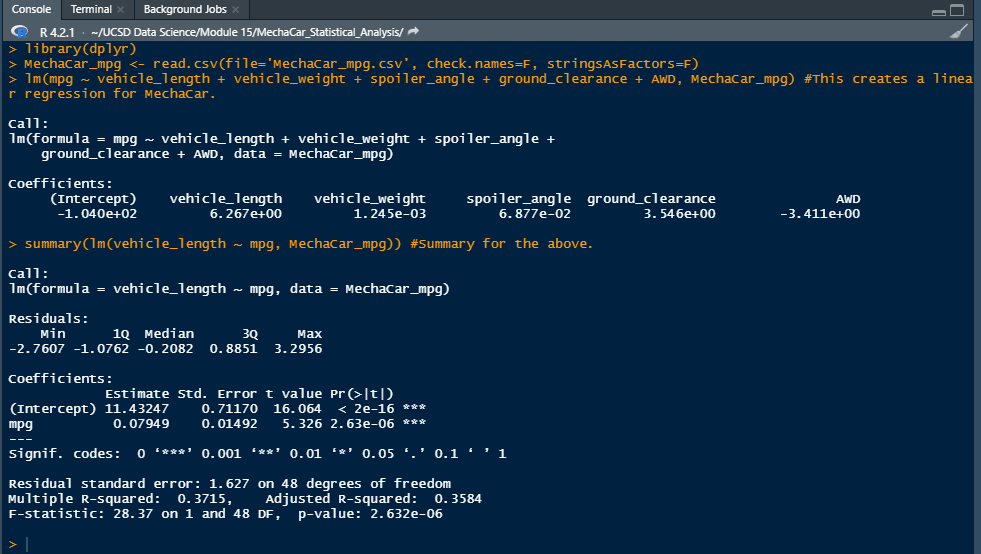

# MechaCar_Statistical_Analysis
## Linear Regression to Predict MPG (Deliverable I)
#### To begin this analysis, it is best list the results from the regression model.  As such:

#### From all the variables listed; Vehicle Length, Vehicle Weight, Spoiler Angle, Ground Clearance, and All Wheel Drive (AWD) the ones that had the most significant effect on the slope line were:
-	Vehicle Length
-	Ground Clearance
-	All Wheel Drive

#### Secondly a plot of the data would reveal that the slope does not equal zero or close to zero but utilizing the p-value from the analysis and using the stated context in 15.7.2 we can see that:
-	p-value = 2.6E-6 which is << that 5.0E-2 and…

#### “Therefore, we can state that there is sufficient evidence to reject our null hypothesis, which means that the slope of our linear model is not zero.”

#### Lastly, we can see our R-squared value is 0.72.  This means that while the three variables above are impacting and important there are perhaps other variables that we are not considering that would allow us to better predict the relationship to Miles per Gallon.  In a sense, the model is good at predicting mpg outcomes but not great.

