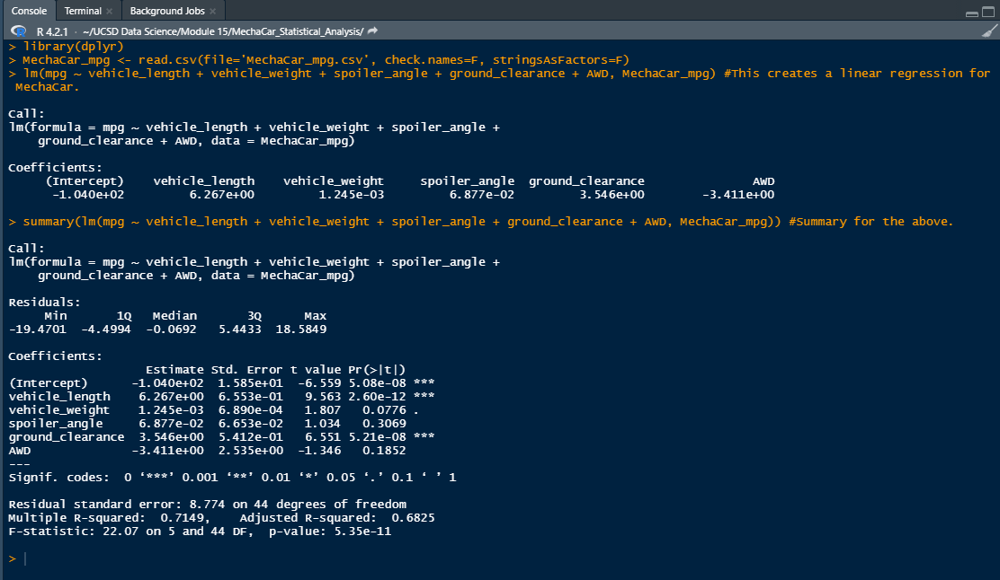
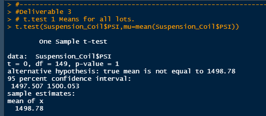
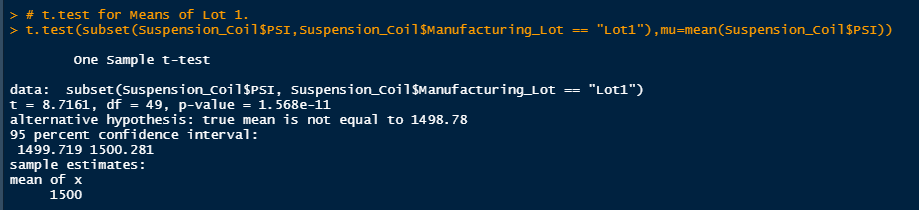
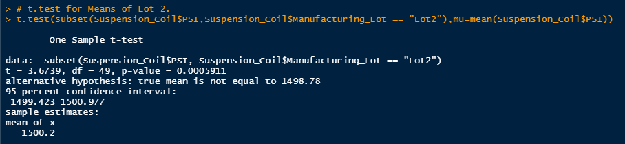
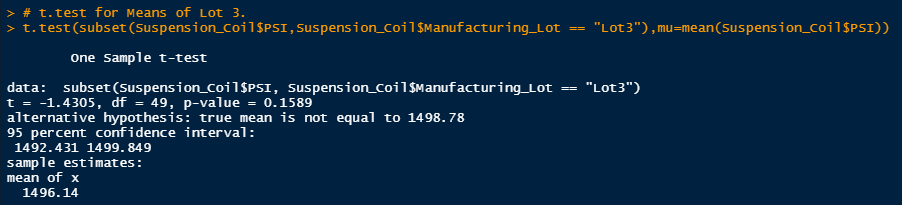

# MechaCar_Statistical_Analysis

## Linear Regression to Predict MPG (Deliverable I)

#### To begin this analysis, it is best list the results from the regression model.  As such:

#### From all the variables listed; Vehicle Length, Vehicle Weight, Spoiler Angle, Ground Clearance, and All Wheel Drive (AWD) the ones that had the most significant effect on the slope line were:
-	Vehicle Length
-	Ground Clearance
-	All Wheel Drive

#### Secondly a plot of the data would reveal that the slope does not equal zero or close to zero but utilizing the p-value from the analysis and using the stated context in 15.7.2 we can see that:
-	p-value = 2.6E-6 which is << that 5.0E-2 and…

#### “Therefore, we can state that there is sufficient evidence to reject our null hypothesis, which means that the slope of our linear model is not zero.”

#### Lastly, we can see our R-squared value is 0.72.  This means that while the three variables above are impacting and important there are perhaps other variables that we are not considering that would allow us to better predict the relationship to Miles per Gallon.  In a sense, the model is good at predicting mpg outcomes but not great.

## Summary Statistics on Suspension Coils (Deliverable II)
#### This exercise demonstrates not only the concept of manufacturing statics but why it is important that constant testing and quality assurance is core to business.  When we look at the testing results for all the coil springs, we find the total batch’s variance is well within the +/- of 100 PSI.  The statical variance for the batch is as follows:

#### The variance is 62.3 and while it is acceptable for the batch this should require further study to find if this is indicative of all the lots within the batch or is there statical outliers that may not be acceptable overall.  Further study shows:

#### As can be seen the variance of the Lots 1 and 2 are very low which indicates that manufacturing standards are high and built to tight tolerances.  When we look at the PSI variance for Lot 3 we can see that the lot is out of specifications @ 170 PSI variance.  This means that the tooling/company/vendor that created lot 3 is producing out of specification coil springs and this need to be investigated.  Not only was the variance in excess of allowable figures but was almost accepted into the batch due to the very low variance of other lots.

####  This segues into one more additional test.

## t-Test on Suspension Coils (Deliverable III)

#### Well start the discussion by introducing the data:

#### Testing the data population in Lot parts yields that the following data for the three different Lots.

#### From the Lot 1 and Lot 2 t-test you can see that p-value << than 0.05 which in this scenario, “we fail to reject the null hypothesis” or that the “the two population means are equal.

####  Lot 3 on the other hand it can be observed that the p-value is 0.16 >> 0.05 and hence the two populations means are not equal as can be observed by the mean x value of 1496.1.

## Study Design: MechaCar Vs. Competition

#### In order to complete the above we would need a greater dataset that included other variables such as price, safety ratings, and other such metrics.

#### We would develop a Null and Alternative Hypothesis somewhere around the ideas of:

-H0 (Null): MechaCar’s competes with its competitors in the areas of X, Y, and Z metrics.

-Ha(Alternative): MechaCar’s does not compete with its competitors by “so much” in the areas of X, Y, and Z.

#### The test used above such as mean, median, linear regression, p-test, and t-test to confirm if any differences exist.  Again, an expanded data set would be needed for this analysis.

